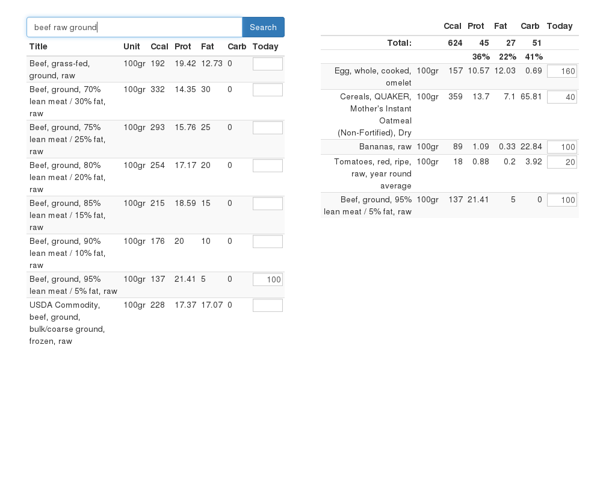

# django-calories-log
Simple app for having your own nutrition diary.

## Why do it?

Because I hate all existing ones. They are too complex, too slow and too unpleasant for me. I failed to find anything suits my needs for 100%.



## Developers howto

It uses python3 and latest Django version (I am going to keep it updated). Pep8 line length is 120 characters, everything else the same as usual.

### How to run project on local machine

Before you start, get used to settings. Check manage.sh for settings provide way and src/nutricalc/settings/base.py for settings read way and full list.

`./venv.sh` - virtualenv will be created and updated. Required for application.
```
psql
create database nutricalc;
create role nutricalc with password 'nutricalc';
grant all privileges on database nutricalc to nutricalc;
```

`./manage.sh validate` - should be no errors

`./manage.sh createsuperuser`

`./runserver.sh` - and navigate to given URL.

Admin panel available at /admin/, api at /api/v1/, api docs at /api/v1/docs/. With admin panel you can add some products for test. 

Check out ./dev/ directory for some things to save time.


## Devops howto

TODO: how to start project on some VPS or cloud service
