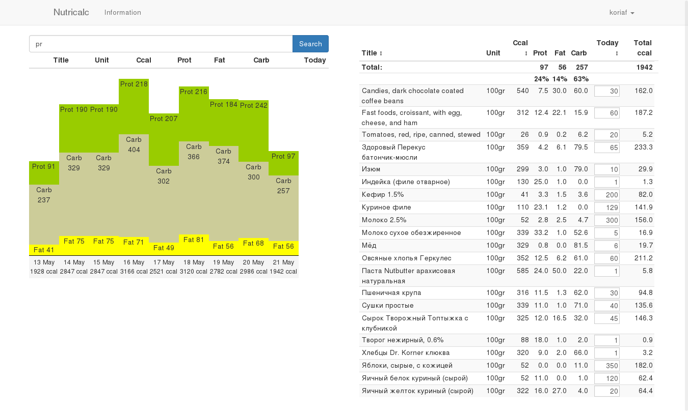

# django-calories-log
Simple app for having your own nutrition diary. Works only in modern browsers (FF, Chrome)
Demo: https://nutricalc.mooserv.org/

[](https://codeclimate.com/github/koriaf/django-calories-log)

## Why do it?

Because I hate all existing ones. They are too complex, too slow and too unpleasant for me. I failed to find anything suits my needs for 100%.

And because I want to try React and unidirectional data flow model. And just practicize with JavaScript and try some new stuff.

I am just playing with JS and React/flux so there are some ugly code and prototypes. I'll deal with it later. Now it just works and already fulfill my needs quite well. One problem - I wasn't able to find good free-licenced russian food database.



## Developers howto

It uses python3 and latest Django version (I am going to keep it updated). Pep8 line length is 120 characters, everything else the same as usual.

### How to run project on local machine

Before you start, get used to settings. Check manage.sh for settings provide way and src/nutricalc/settings/base.py for settings read way and full list.

`./venv.sh` - virtualenv will be created and updated. Required for application.
```
psql
create database nutricalc;
create role nutricalc with password 'nutricalc';
grant all privileges on database nutricalc to nutricalc;
```

`./manage.sh validate` - should be no errors

`./manage.sh createsuperuser`

`./runserver.sh` - and navigate to given URL.

Admin panel available at /admin/, api at /api/v1/, api docs at /api/v1/docs/. With admin panel you can add some products for test. 

Check out ./dev/ directory for some things to save time.


## Devops howto

TODO: how to start project on some VPS or cloud service

    $ npm install
    # update settings - set STATIC_ROOT at least and postgresql database credentials
    $ ./manage.sh collectstatic -i '*.map' -i "*jquery/src*" --noinput 
